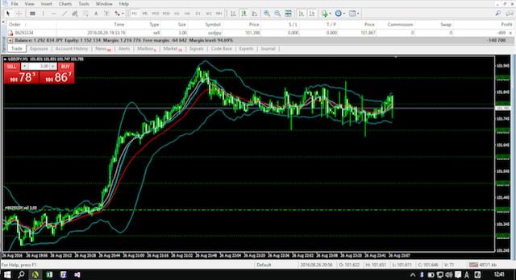

[](https://github.com/callmekohei/MetaTraderFs/blob/master/LICENSE)

# MetaTraderFs
Bollinger Band + EMA10, SMA13, EMA25 and Grid

### Install
```
$ git install https://github.com/callmekohei/MetaTraderFs
```

### Like this


### Tips for creating DLL
requring Windows

target cpu : 32bit
